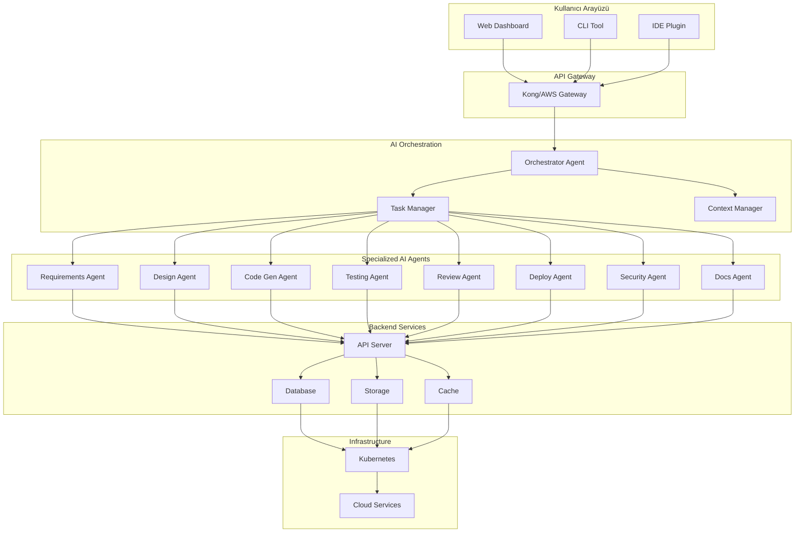
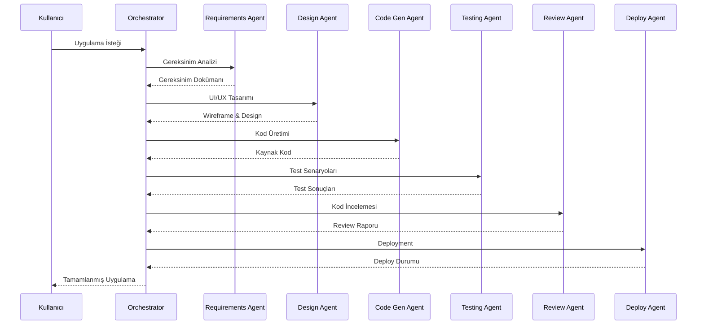
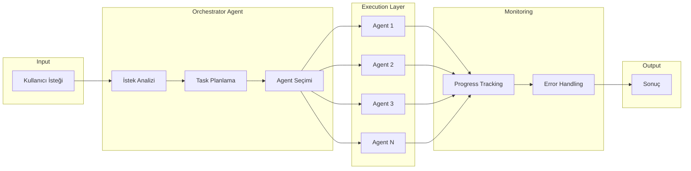
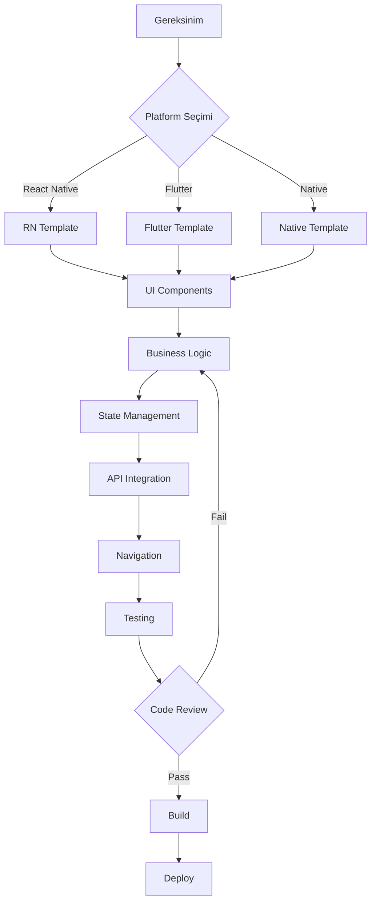
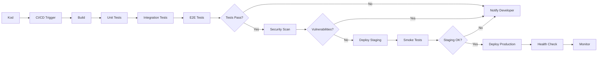
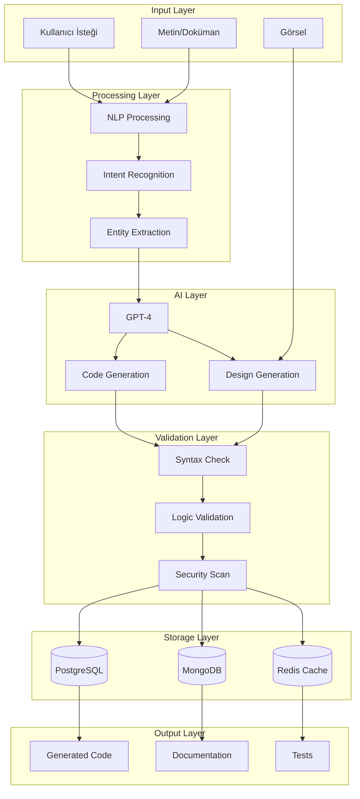
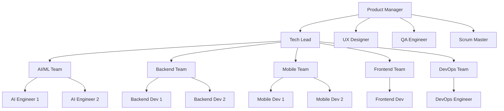
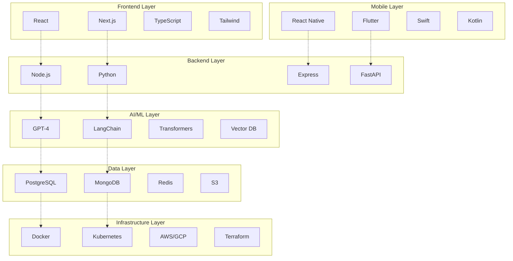
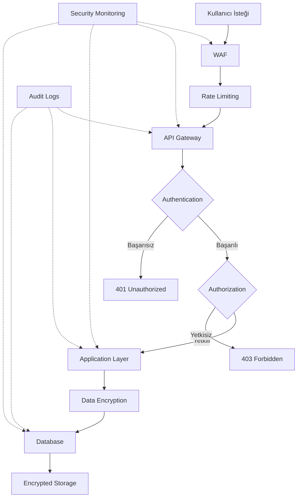
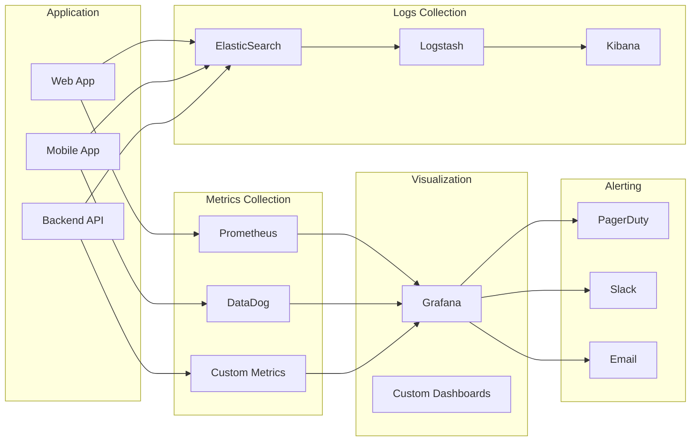

# Sistem Mimarisi Diyagramları

## 1. Genel Sistem Mimarisi

## 2. AI Agent İş Akışı

## 3. Agent Koordinasyon Akışı

## 4. Kod Üretim Pipeline

## 5. Deployment Pipeline

## 6. Data Flow

## 7. Ekip Organizasyonu

## 8. Teknoloji Stack Katmanları

## 9. Güvenlik Katmanları

## 10. Monitoring ve Analytics

---

## Diyagram Açıklamaları

### Genel Sistem Mimarisi
Sistemin beş ana katmandan oluştuğunu gösterir:
1. Kullanıcı arayüzü (web, CLI, IDE)
2. AI orchestration katmanı
3. Specialized AI agents
4. Backend services
5. Infrastructure

### AI Agent İş Akışı
Bir mobil uygulama geliştirme talebinin agent'lar arasındaki akışını sequence diagram ile gösterir.

### Agent Koordinasyon
Orchestrator agent'ın diğer agent'ları nasıl koordine ettiğini gösterir.

### Kod Üretim Pipeline
Gereksinimden deploy edilebilir koda kadar olan süreci gösterir.

### Deployment Pipeline
CI/CD pipeline'ının adımlarını ve kontrol noktalarını gösterir.

### Data Flow
Verinin sistemde nasıl işlendiğini ve saklandığını gösterir.

### Ekip Organizasyonu
Team yapısını ve raporlama hatlarını gösterir.

### Teknoloji Stack
Farklı katmanlarda kullanılan teknolojileri gösterir.

### Güvenlik Katmanları
Sistemdeki güvenlik kontrol noktalarını gösterir.

### Monitoring
Sistem izleme ve uyarı mekanizmalarını gösterir.

---

**Not**: Bu diyagramlar GitHub, GitLab gibi platformlarda otomatik olarak render edilir. Yerel olarak görmek için Mermaid destekleyen bir Markdown viewer kullanın.

**Referans**: [Mermaid Documentation](https://mermaid.js.org/)
